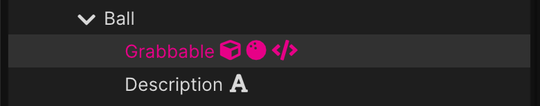
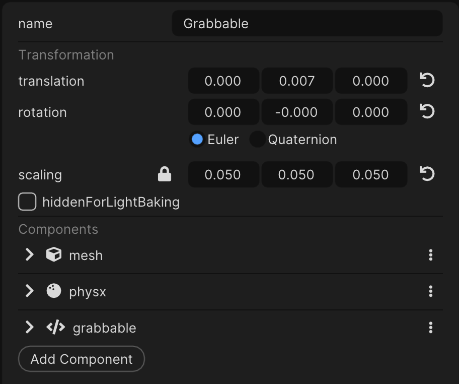
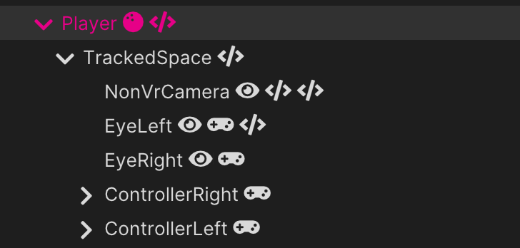
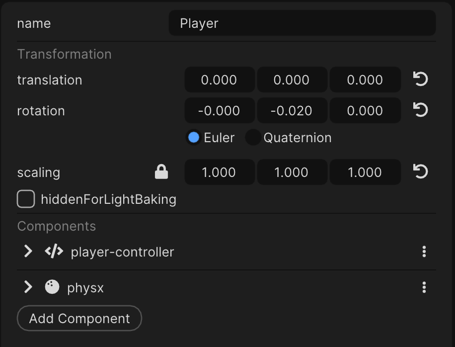
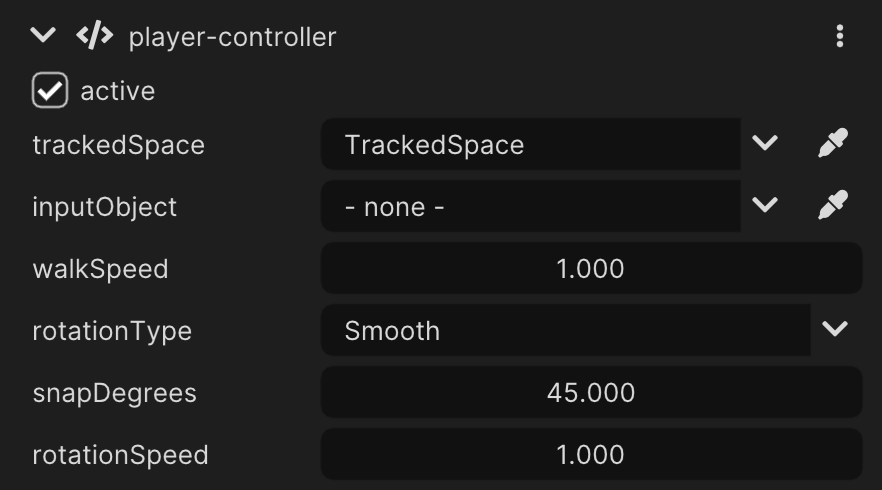

# Documentation

## Interaction

Interactions span multiple components:
* **Interactor**: Initiates the interaction (e.g., Meta Quest controller)
* **GrabPoint**: The point of interaction with the interactor
* **Grabbable**: Linking one or multiple grab points together

While the **interactor** initiates the interaction with a **grab point**, the **grabbble** undergoes
the interaction.

Example:

Door                        |  Grabbable Representation
:---------------------------: | :-----------------------------------:
 | 

### Interactor

* Check for grab points to interact with, either:
    * Based on distance
    * Via a native [Collision](https://wonderlandengine.com/jsapi/collisioncomponent/) component
    * Via a native [Physx](https://wonderlandengine.com/jsapi/physxcomponent/) component

> By default, it uses the WebXR [squeezestart](https://developer.mozilla.org/en-US/docs/Web/API/XRSession/squeezestart_event) event to search for grabs opportunities.

The interactor **doesn't** track for controller transform; this must be achieved using [Input](https://wonderlandengine.com/jsapi/inputcomponent/), or your own component.

Most of the time, you will want the `interactor` component to be set on the controller or its hierarchy:

Door                        |  Grabbable Representation
:---------------------------: | :-----------------------------------:
 | 

> `TrackedSpace` is requiredif you plan on moving the player using the `player-controller` component.

### Grabbable

The grabbable responds to the the interactor based on which [grab point](#grab-point) was grabbed.

#### Transformation Type

The grabbable can be transformed in two ways:
* Using the interactor's position and rotation
    * Achieved using `GrabRotationType.Hand`
    * Used for a ball, a weapon, any object that should follow the hand
* Using the interactor's position, but computing a rotation from it around the grabbable origin
  * Achieved using `GrabRotationType.Hand`
  * Used for for doors, levers, basically interactables that have a fixed origin

Example of a grabbable using `GrabRotationType.Hand`:

https://github.com/user-attachments/assets/3867e909-9bfe-4b7c-9bea-c44b3e7bb1d5

Example of a grabbable using `GrabRotationType.AroundPivot`:

https://github.com/user-attachments/assets/ea50025c-96c6-4846-9695-38327a218bd2

#### Throw

If `Grabbable.canThrow` is `true`, the object will be thrown when the interactor releases it.

This is accomplished using the grabbable physx component [linearVelocity](https://wonderlandengine.com/jsapi/physxcomponent/#linearVelocity) and [angularVelocity](https://wonderlandengine.com/jsapi/physxcomponent/#angularVelocity) properties.

### GrabPoint

The `GrabPoint` component defines thye "link" between an interactor and a grabbable.

> By default, the `Grabbable` component will create a default `GrabPoint` on itself

In the `Playground.wlp` example, the `Ball` uses the default grabbable setup, i.e., no grab point is specified:

Ball Hierarchy              |  Ball Properties
:-------------------------: | :-----------------------------------:
 | 

#### Search

By default, a grab point is grabbed by distance. No additional [collision](https://wonderlandengine.com/jsapi/collisioncomponent/) or
[physx](https://wonderlandengine.com/jsapi/physxcomponent/) component is required.

This behavior can be changed by setting the `GrabPoint.searchMode` property to `GrabSearchMode.Overlap`. In that case, the collision or physx component of the object is used as the grab point.

#### Lerp

When using a large grab distance, or a large collision box, the interaction between a grab point and the interactor can begin even when their origins don't perfectly match.

`GrabPoint.snapLerp` can be used to customize how fast both origin will match. The higher the value, the faster
the grab point and interactor origins will align.

Example with lerp set to `1.0` (i.e., no lerp effect):

https://github.com/user-attachments/assets/30f1d634-06ac-4733-ba7f-62067f1822b9

Example with lerp set to `0.1`:

https://github.com/user-attachments/assets/66f8263d-c0f5-4c9b-8063-fd10bb4640d8

## Locomotion

### PlayerController

The `player-controller` is a simple smooth locomotion implementation, based on the **physics**
engine.

> The locomotion isn't implemented using using kinematic.

Example of a hierarchy setup to use locomotion:

Player Hierarchy              |  Player Properties
:-------------------------: | :-----------------------------------:
 | 

> The `physx` component is mandatory and used for the movements.

#### Properties

`trackedSpace` is the only **required** property, used for the rotation.

#### Rotation Type

* Snap: Rotate by a `snapDegrees` amount
    * The input initiating the rotation must be released to rotate again
* Smooth: Rotate smoothly with speed `rotationSpeed`

> Smooth rotation should be used carefully as it can induce heavy motion sickness.
