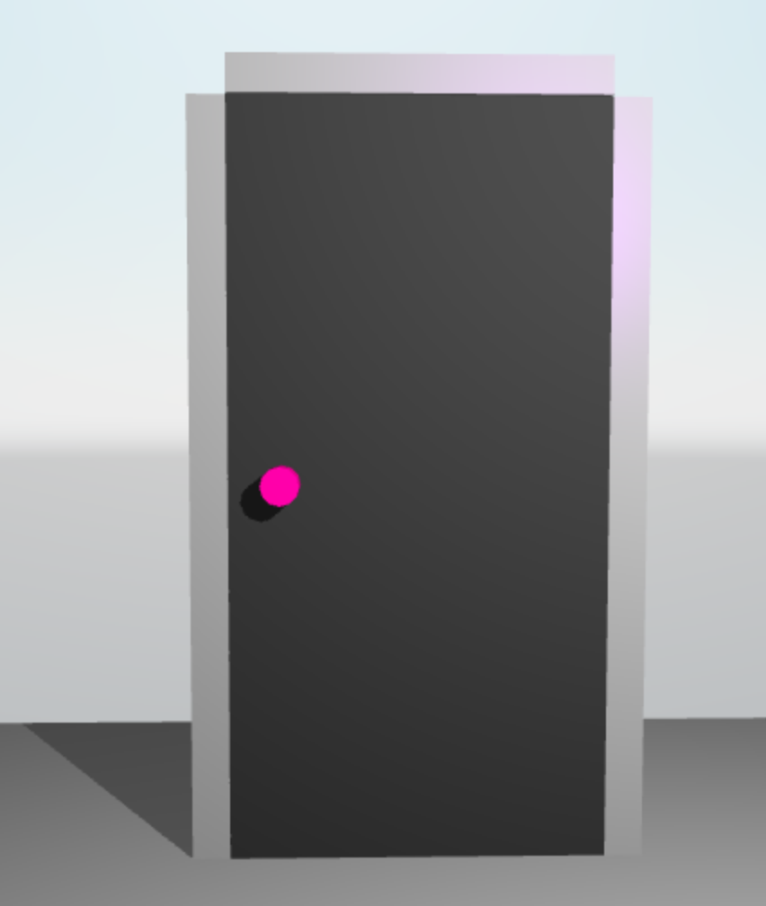
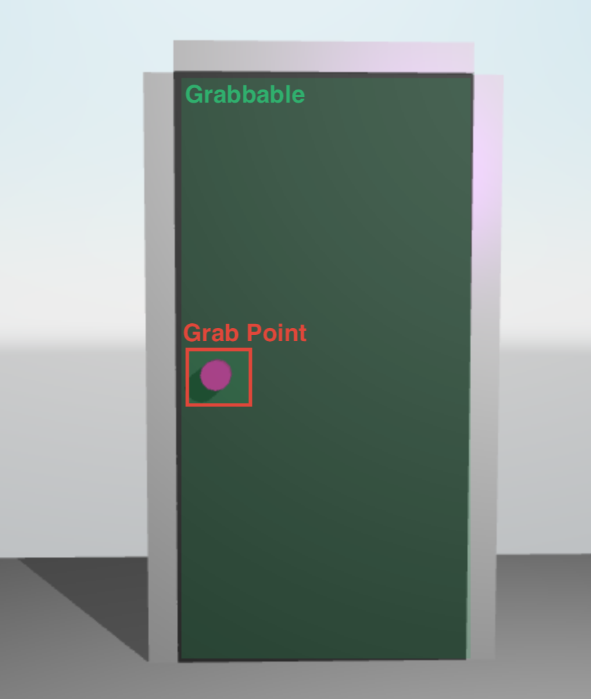
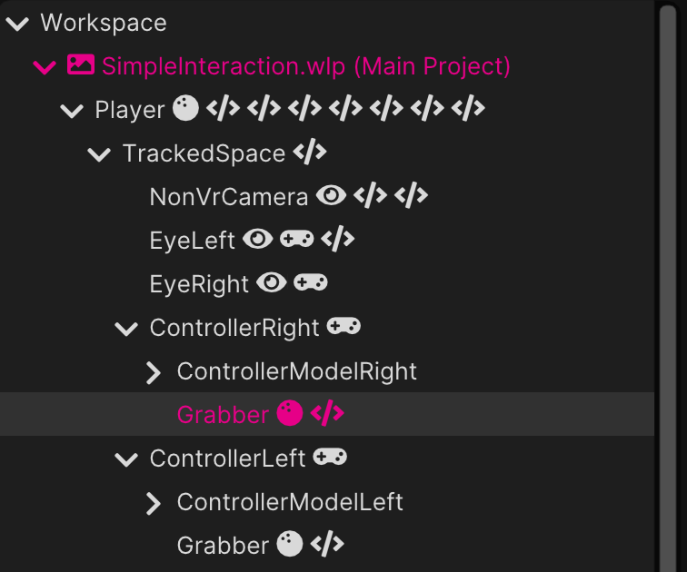
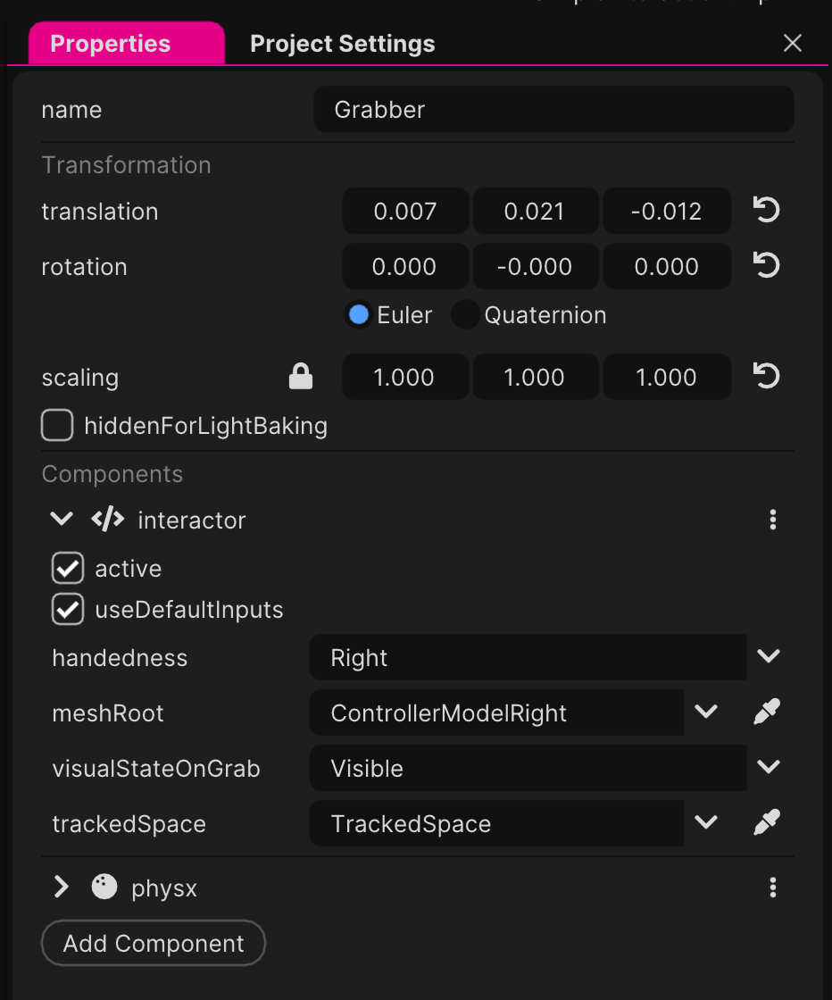

# Documentation

## Interaction

Interactions span multiple components:
* **Interactor**: Initiating the interaction, e.g., Meta Quest controller
* **GrabPoint**: Point of interaction with the interactor
* **Grabbable**: Linking one or multiple grab points together

While the **interactor** starts the interaction with a **grab point**, the **grabbble** undergoes
the interaction.

Example:

Door                        |  Grabbable Representation
:---------------------------: | :-----------------------------------:
 | 

### Interactor

The interactor specifically:
* Check for grab points to interact with either:
    * Based on distance
    * Via a native [Collision](https://wonderlandengine.com/jsapi/collisioncomponent/) component
    * Via a native [Physx](https://wonderlandengine.com/jsapi/physxcomponent/) component

> By default, it uses the WebXR [squeezestart](https://developer.mozilla.org/en-US/docs/Web/API/XRSession/squeezestart_event) event to search for grabs

The interactor **doesn't** track for controller transform, this must be achieved using the native [Input](https://wonderlandengine.com/jsapi/inputcomponent/) component, or your own version.

Most of the time, you will want the `interactor` component is set on the controller or in the controller hierarchy:

Door                        |  Grabbable Representation
:---------------------------: | :-----------------------------------:
 | 

### Grabbable

The grabbable will undergo the effect of the interactor, based on which [grab point](#grab-point) was grabbed.

## Locomotion

## Interactor / Interactable

The interactor

## Single-Hand

TODO

## Single-Hand

TODO

## Set up interaction
- Enable Physx in project
- Add `Interactor` to left and right controllers and set them accordingly

## Player Controller

At the root of the xr rig is a `Player` object. The player object has a `wlei:player-controller` component and a `physx` component.

XR Rig:
Player(Object)
| wlei:player-controller
| physx
| wlei:locomotion-selector
| wlei:smooth-locomotion
| wlei:teleport-locomotion
| wlei:player-rotate
| wlei:input-bridge
+ TrackedSpace (Object)
  | player-height

### wlei:player-controller

This is the heart of the player controller system. It uses physx to move the player around. Based on preferences the player
