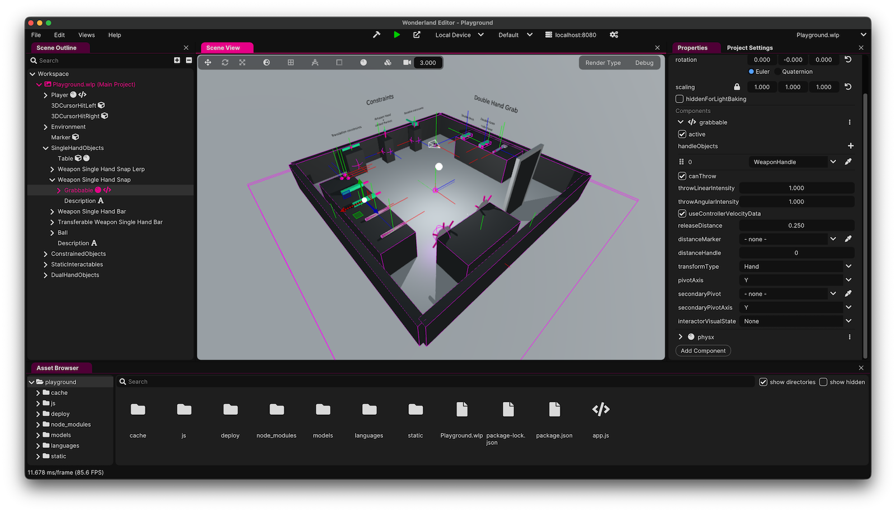

<picture>
  <source media="(prefers-color-scheme: dark)" srcset="https://github.com/WonderlandEngine/api/blob/master/img/wle-logo-horizontal-reversed-dark.png?raw=true">
  <source media="(prefers-color-scheme: light)" srcset="https://github.com/WonderlandEngine/api/blob/master/img/wle-logo-horizontal-reversed-light.png?raw=true">
  
</picture>

# WE-IL: Wonderland Engine Interaction Library

## Features

* Generic interactor / interactable
* Single-hand grabbing
* Double-hand grabbing
* Event system
* Throwing

## Install

The library is in development mode and not already available on `npm`. However, you can already use it locally either with [npm link](https://docs.npmjs.com/cli/v8/commands/npm-link), or using a local installation:

First, install and build the library:

```sh
cd path/to/weil
npm i
npm run build
```

Then, link it to your project:

```sh
cd path/to/my/project
npm i path/to/weil
```

## Examples

1. Clone the repository
2. Open any examples under `examples/*`



#### Playground

* Single-hand grabbing
* Double-hand grabbing

## Usage

For more information about how to use the components, please refer to the [./DOC.md](documentation).

## ToDo List

* [ ] Disable distance grabbing when a double-hand grabbable is only grabbed with one hand
* [ ] Emulate angular velocity
* [ ] Improve throwing speed uniformity between emulated and native
* [ ] Find a way to improve performance for collision check (distance grab)
* [ ] Interaction mapping for selection / shoot etc...

### Player controller
* [ ] General setup for player controller based on physx
* [ ] Prevent from moving through walls
* [ ] Prevent from putting your head into the wall (fade to black)
* [ ] different ways of movement (smooth locomotion, teleport, room scale)
* [ ] different ways of rotating (smooth, snap)
* [ ] input support for VR controllers, Keyboard, Mouse, Touch, Gamepad?
