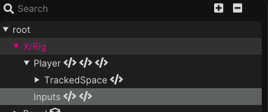
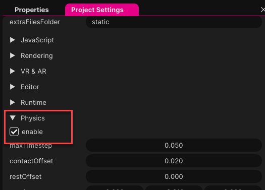
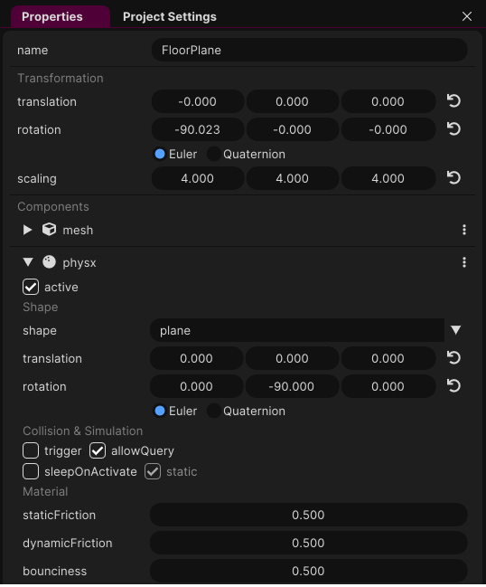
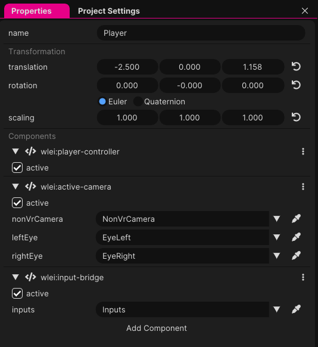

# Player Controller Tutorial

In this tutorial, we're going to set up a basic player controller using a combination of components from the interaction library. For this tutorial, the starting point is a new project based on the VR template.

### Step 1: Create the XR Rig

First, we need to set up the base object for our player controller, the XR Rig. This groups everything related to the controller.

- In your scene hierarchy, create an empty object at the root level. Name this object `XrRig`.

### Step 2: Organize the Player

Now, let's organize our player setup within this `XrRig`.

- Place your original player GameObject inside the `XrRig`, making it a child of `XrRig`.

### Step 3: Enable PhysX

For physics interactions, we'll need to enable PhysX within the project settings.

- Go to your project settings and make sure the PhysX option is enabled.

### Step 4: Configure the Ground

Let's ensure that our ground is prepared for physics interactions.

- Select your `FloorPlane` GameObject.
- Remove the existing collision components it has.
- Add a new physx component.
- Set its rotation to `0, -90, 0` in the inspector.

### Step 5: Add Camera and Controller Components

The player needs a camera and controller components to navigate the environment.

- Select your Player GameObject.
- Add an `ActiveCamera` component to allow for camera control.
- Add a `PlayerController` component to enable player movement and controls.

### Step 6: Setup Input Bridge

For handling input, we will use an Input Bridge component.

- Add an `Input Bridge Component` to your `XrRig` or Player, depending on how you prefer to structure your components.

### Step 7: Add Input Objects

We will now add objects to handle various inputs.

- Under the `XrRig`, create an empty GameObject and name it `inputs`.
- Inside `inputs`, create two more empty GameObjects:
    - Name one `controls-keyboard` for keyboard input handling.
    - Name the other `controls-vr` for VR input handling.

### Step 8: Configure Input Bridge

Finally, we need to link our input handlers to the Input Bridge.

- Select the Input Bridge Component on your Player or XR Rig.
- Drag the `inputs` GameObject into the designated field on the Input Bridge Component to set it as the input source.

And that concludes the basic setup for a player controller with XR and PhysX integration. Make sure to save your scene and test it to see everything in action. If you encounter any issues, review the steps to ensure all components have been added correctly. To prevent the player from walking into walls, you can add PhysX components to the walls. Make sure to set these to `static`.
